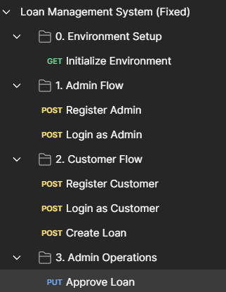

# Loan management system

## Phase-1 Running the all the service 

Steps to download and run
1. Clone or download zip whole git repo
2. import each services to your workspace [ eclipse, VScode,etc]
3. visit each service application.properties file.

4. update you db username and password and save

    PATH [ example]

    auth-service\auth-service\src\main\resources\application.properties

    ```java
    spring.datasource.username=root
    spring.datasource.password=sky1234
5. Run each service in order as mentioned below: 

    1. eureka-server
    2. api-gateway
    3. auth-service
    4. loan-service
    5. payment-service

6. visit http://localhost:8761/

    check all service are up

7. keep everthing running in background

## Phase-2 - Testing all api's end points

8. open postman 
9. create a workspace
10. import the file - lms01.json
11. Set the environment variable

    base_url = http://localhost:8080

    admin_token [keep empty]
    
    customer_token [keep empty]

    loan_id [keep empty]
 

12. run in order

    0. Environment Setup [what ever the reposonse come - ignore]

    1. Admin Flow

    2. Customer Flow

    3. Admin Operations


13. All should pass .

14. END!